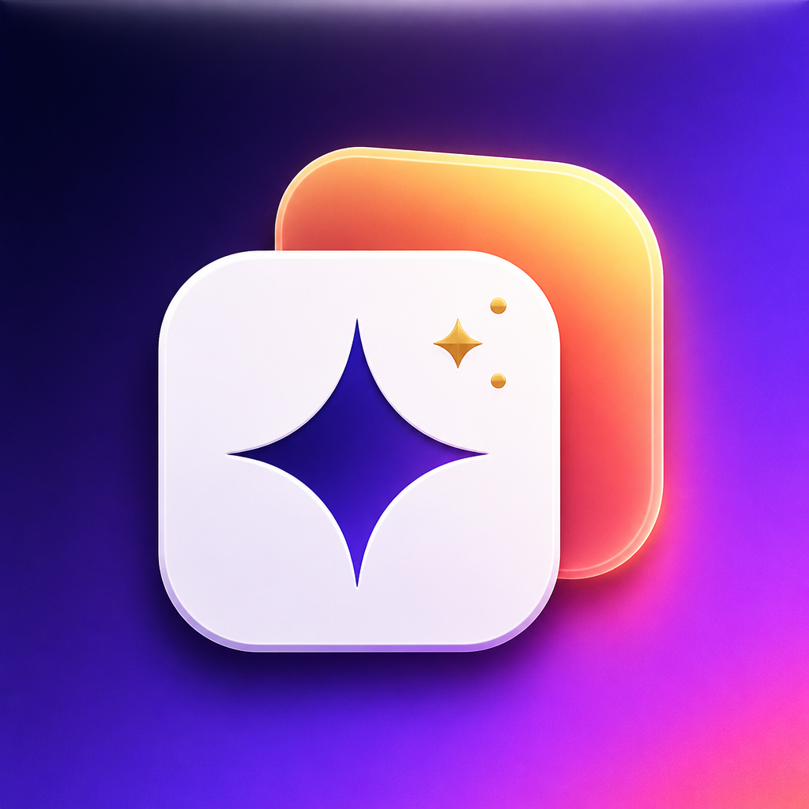
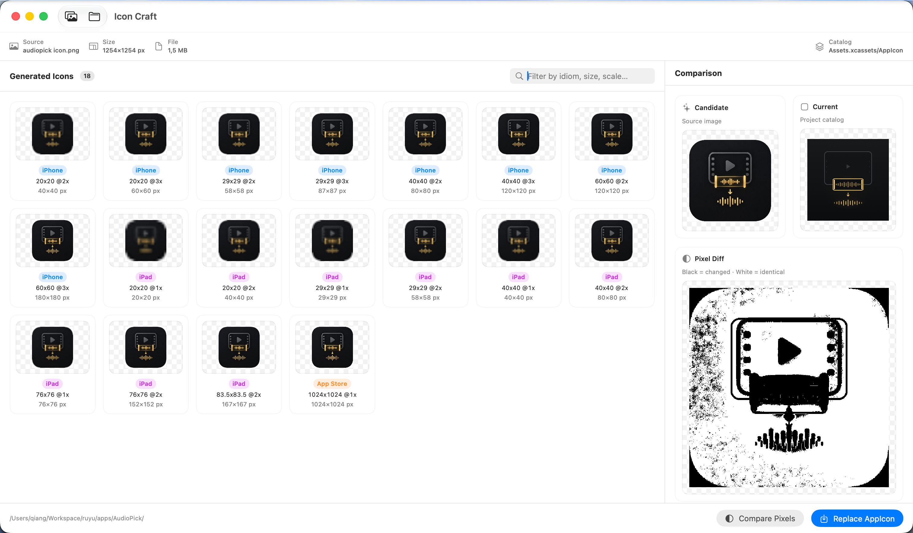

<div align="center">

  

  # IconCraft (图标匠)

  **The Pixel-Perfect iOS App Icon Generator & Asset Replacer for macOS.**

  [](https://apple.com/macos)
  [](https://swift.org)
  [](https://developer.apple.com/xcode/swiftui/)
  [](LICENSE)
  [](https://github.com/yourusername/IconCraft/releases)
  [](https://github.com/yourusername/IconCraft)

  <p align="center">
    <a href="#key-features">Key Features</a> •
    <a href="#quick-start">Quick Start</a> •
    <a href="#installation">Installation</a> •
    <a href="#pixel-diff-engine">Pixel Diff Engine</a> •
    <a href="#building-from-source">Build from Source</a> •
    <a href="#license">License</a>
  </p>

  

</div>

---

## 💡 Why IconCraft?

Replacing app icons in Xcode often means repetitive manual work: exporting dozens of PNG resolutions, dragging them into Asset Catalog slots, and risking outdated `Contents.json` structures. Online tools require uploading unreleased assets to third-party servers.

**IconCraft** automates this workflow locally in seconds:
1. Drag in your high-res `1024×1024` master icon.
2. Select your iOS project directory — IconCraft automatically scans and targets your `AppIcon.appiconset`.
3. Inspect pixel-level visual differences against the current version.
4. Replace all specifications and generate a validated `Contents.json` with a single click.

---

## ✨ Key Features

- **⚡️ Full iOS Specification Matrix:** Automatically generates all required scales and dimensions across iPhone, iPad, and App Store Marketing formats (1024x1024).
- **🔍 Intelligent Project Inspector:** Automatically traverses your iOS repository to locate and link `.appiconset` catalogs.
- **🌓 Pixel-Level Diff Engine:** Built on top of CoreGraphics byte-buffer analysis. Identifies visual changes immediately:
  - **Black (`#000000`)**: Pixel discrepancies / modified regions.
  - **White (`#FFFFFF`)**: Identical / unchanged regions.
- **🚀 Atomic Asset Packaging:** Bundles all resized PNG assets and writes a clean, formatted `Contents.json` directly into your Xcode project.
- **🛡️ 100% On-Device & Privacy-First:** Zero network requests, zero telemetry, and zero third-party dependencies. All image processing is handled on hardware threads.

---

## 📋 Generated Icon Specifications

IconCraft strictly complies with the latest Apple Human Interface Guidelines:

| Device / Idiom | Size (Points) | Scale | Rendered Pixels | Target Usage |
| :--- | :--- | :--- | :--- | :--- |
| **iPhone** | `20x20` | `2x`, `3x` | 40px, 60px | Notifications |
| **iPhone** | `29x29` | `2x`, `3x` | 58px, 87px | Settings & Spotlight |
| **iPhone** | `40x40` | `2x`, `3x` | 80px, 120px | Spotlight Search |
| **iPhone** | `60x60` | `2x`, `3x` | 120px, 180px | Home Screen App Icon |
| **iPad** | `20x20`, `29x29`, `40x40` | `1x`, `2x` | 20px - 80px | Notifications, Settings, Spotlight |
| **iPad** | `76x76`, `83.5x83.5` | `1x`, `2x` | 76px, 152px, 167px | iPad & iPad Pro Home Screen |
| **iOS Marketing** | `1024x1024` | `1x` | 1024px | App Store Listing Icon |

---

## 📦 Installation

### Option 1: Direct Download (Recommended)
Download the latest `IconCraft.dmg` directly from the [GitHub Releases](https://github.com/yourusername/IconCraft/releases) page. Drag **IconCraft.app** into your `/Applications` directory.

### Option 2: Homebrew Cask (Coming Soon)
```bash
brew install --cask iconcraft